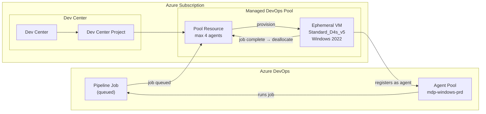
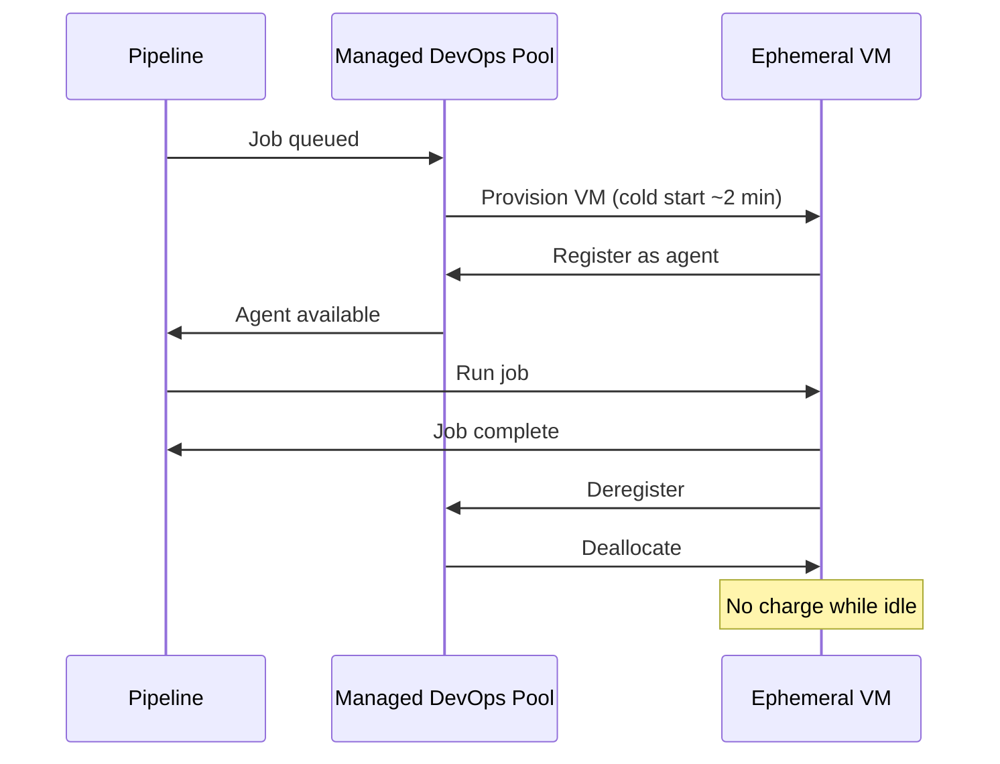

# Azure Managed DevOps Pools

Bicep templates and Azure DevOps pipelines to deploy and manage [Managed DevOps Pools](https://learn.microsoft.com/en-us/azure/devops/managed-devops-pools/overview) — Microsoft's replacement for VMSS-based scale set agents.

Managed DevOps Pools provisions ephemeral Azure VMs on-demand when pipeline jobs are queued, and deallocates them when jobs complete. No agent infrastructure to maintain.

## Architecture



## Agent lifecycle



## Structure

```
.azuredevops/
├── Deploy-ManagedDevOpsPools.yaml   # CD pipeline — deploys on push to main
└── PR-Validation.yaml               # CI pipeline — validates Bicep on PRs

.github/workflows/
└── check-avm-versions.yml           # Weekly AVM version check — auto-raises PRs

bicep/
├── main.bicep                       # Entry point — calls AVM modules
└── main.bicepparam                  # Parameters (copy and customise per environment)

docs/
└── Getting-Started.md               # Prerequisites and first-time setup

scripts/
├── Get-PoolAgentStatus.ps1          # Check active agents on a pool
└── Update-AvmVersions.py            # AVM version checker (used by GitHub Actions)

bicepconfig.json                     # AVM public registry alias
```

## AVM modules used

| Module | Version | Resource |
|---|---|---|
| `avm/res/dev-center/dev-center` | 0.1.4 | Dev Center |
| `avm/res/dev-center/project` | 0.1.2 | Dev Center Project |
| `avm/res/dev-ops-infrastructure/pool` | 0.2.0 | Managed DevOps Pool |

Check latest versions: [AVM Bicep Resource Modules](https://azure.github.io/Azure-Verified-Modules/indexes/bicep/bicep-resource-modules/)

## Quick start

See [docs/Getting-Started.md](docs/Getting-Started.md) for prerequisites and service connection setup.

```bash
# Restore AVM modules locally
az bicep restore --file bicep/main.bicep

# Validate
az deployment group validate \
  --resource-group rg-devops-agents-prd \
  --template-file bicep/main.bicep \
  --parameters bicep/main.bicepparam

# Deploy
az deployment group create \
  --resource-group rg-devops-agents-prd \
  --template-file bicep/main.bicep \
  --parameters bicep/main.bicepparam
```

## Use the pool in a pipeline

Reference the pool by name in your Azure DevOps pipeline YAML:

```yaml
pool:
  name: mdp-windows-prd
```

## Contributing

Changes go through a pull request — the PR validation pipeline runs `az bicep build` and a preflight `validate` against the target resource group before merge. AVM module versions are checked weekly and updated automatically via pull request.
