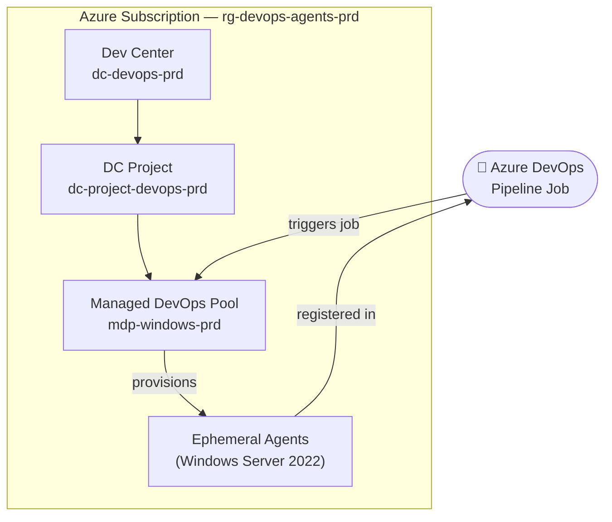

# Managed DevOps Pools

[Azure Managed DevOps Pools](https://learn.microsoft.com/en-us/azure/devops/managed-devops-pools/overview) — Bicep (AVM) templates and Azure DevOps pipelines for on-demand ephemeral build agents.

## Architecture



Agents are **stateless** — a fresh VM is provisioned per job and deallocated when complete. No persistent agent infrastructure; cost is purely on-demand.

## Structure

```
.azuredevops/
└── Deploy-ManagedDevOpsPools.yaml   # CD pipeline — deploys on push to main

.github/workflows/
├── mdp.module.yml                   # e2e test trigger (PSRule + defaults scenario)
└── check-avm-versions.yml           # Weekly AVM version check

bicep/
├── main.bicep                       # Dev Center + DC Project + Managed DevOps Pool
└── main.bicepparam                  # Parameters (customise per environment)

docs/
└── Getting-Started.md               # Prerequisites and initial setup

scripts/
├── Get-CostEstimate.ps1             # Retail Prices API cost estimate — used by e2e workflow
├── Get-PoolAgentStatus.ps1          # Show current agent status in the pool
├── Test-ManagedDevOpsPool.ps1       # Validate a deployment is healthy
└── Update-AvmVersions.py            # AVM version checker (used by GitHub Actions)

tests/e2e/
└── defaults/
    ├── main.test.bicep              # Subscription-scoped test bicep — DC + project + 1-agent pool
    └── mdp.defaults.test.ps1        # Pester v5 assertions for defaults scenario

bicepconfig.json                     # AVM public registry alias
```

## AVM modules used

| Module | Version | Resource |
|---|---|---|
| `avm/res/dev-center/dev-center` | 0.1.4 | Dev Center |
| `avm/res/dev-center/project` | 0.1.2 | Dev Center Project |
| `avm/res/dev-ops-infrastructure/pool` | 0.2.0 | Managed DevOps Pool |

Check latest versions: [AVM Bicep Resource Modules](https://azure.github.io/Azure-Verified-Modules/indexes/bicep/bicep-resource-modules/)

## Quick start

See [docs/Getting-Started.md](docs/Getting-Started.md) for prerequisites (service principal, ADO permissions).

```bash
az bicep restore --file bicep/main.bicep

az deployment group create \
  --resource-group rg-devops-agents-prd \
  --template-file bicep/main.bicep \
  --parameters bicep/main.bicepparam \
  --parameters organizationUrl='https://dev.azure.com/YOUR-ORG'
```

## CI / Testing

Testing follows the [Azure Verified Modules e2e pattern](https://azure.github.io/Azure-Verified-Modules/contributing/bicep/bicep-contribution-flow/validate-bicep-module-locally/) via the shared [`awood-ops/.github`](https://github.com/awood-ops/.github) reusable workflow.

### Pipeline overview

```
On push / PR (bicep/** or tests/**)
│
├── PSRule for Azure    Static analysis — compiles Bicep → ARM, runs best-practice rules.
│                       No Azure credentials needed. Blocks e2e if it fails.
│
└── e2e / defaults      Deploys Dev Center + Project + 1-agent pool; runs Pester assertions;
                        deletes RG on completion.
```

The e2e lifecycle is managed by [`e2e.reusable.yml`](https://github.com/awood-ops/.github/blob/main/.github/workflows/e2e.reusable.yml):

```
OIDC login → what-if preflight → deploy → Pester assertions → [AzQR] → [cost estimate] → cleanup
```

### Test scenario

| Scenario | VM size | Max concurrency | Approx. duration |
|---|---|---|---|
| `defaults` | Standard_D2s_v5 | 1 | ~15–20 min (Dev Center provisioning) |

> Dev Center provisioning takes significantly longer than most Azure resources. The e2e run is triggered on PRs but is not a merge gate — failing runs should be investigated before merging.

### Optional analysis (workflow_dispatch only)

When triggering via **Actions → MDP Module — e2e Tests → Run workflow**:

| Input | Description | Artifact |
|---|---|---|
| `run_azqr` | [AzQR](https://github.com/Azure/azqr) best-practice scan | `azqr-defaults/` |
| `run_cost_estimate` | Per-resource monthly estimate via [Azure Retail Prices API](https://learn.microsoft.com/en-us/rest/api/cost-management/retail-prices/azure-retail-prices) | `cost-estimate-defaults/` |

### Running tests locally

```bash
# Deploy the defaults scenario
az deployment sub create \
  --location uksouth \
  --template-file tests/e2e/defaults/main.test.bicep \
  --parameters namePrefix=mdplocal organizationUrl='https://dev.azure.com/YOUR-ORG'

# Run Pester assertions (Pester v5 + PowerShell 7 required)
$env:TEST_RG          = 'dep-mdplocal-mdp'
$env:TEST_NAME_PREFIX = 'mdplocal'
Invoke-Pester ./tests/e2e/defaults -Output Detailed

# Cleanup
az group delete --name dep-mdplocal-mdp --yes
```

### Required secrets

| Secret | Description |
|---|---|
| `AZURE_CLIENT_ID` | App registration client ID for OIDC federation |
| `AZURE_TENANT_ID` | Entra tenant ID |
| `AZURE_SUBSCRIPTION_ID` | Target subscription for test deployments |
| `AZURE_DEVOPS_ORG_URL` | Azure DevOps org URL (e.g. `https://dev.azure.com/my-org`) |

The OIDC service principal requires `Contributor` on the test subscription and `DevOps Infrastructure Pool Admin` in the Azure DevOps organisation.

## Contributing

Changes go through a pull request. PSRule for Azure runs on every PR as a pre-gate. AVM module versions are checked weekly and updated automatically via pull request.
